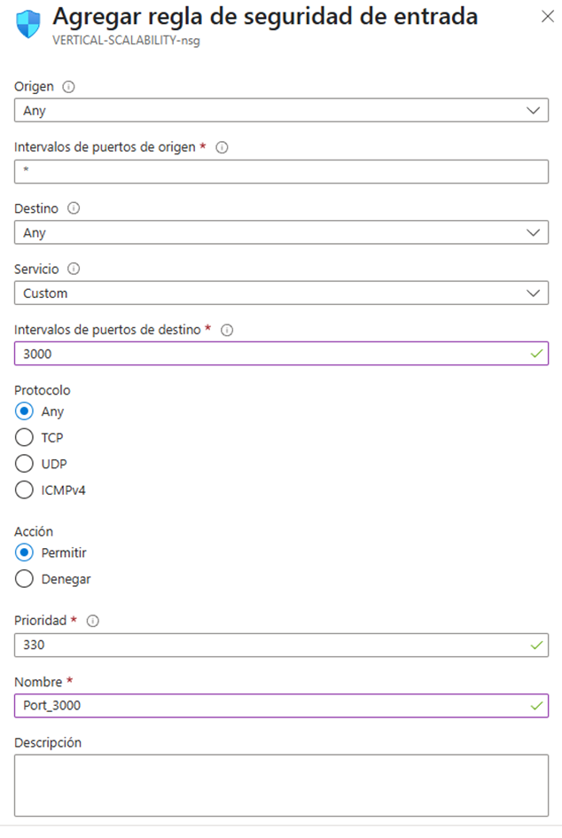
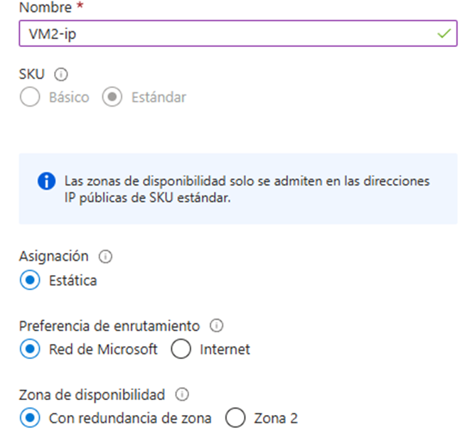
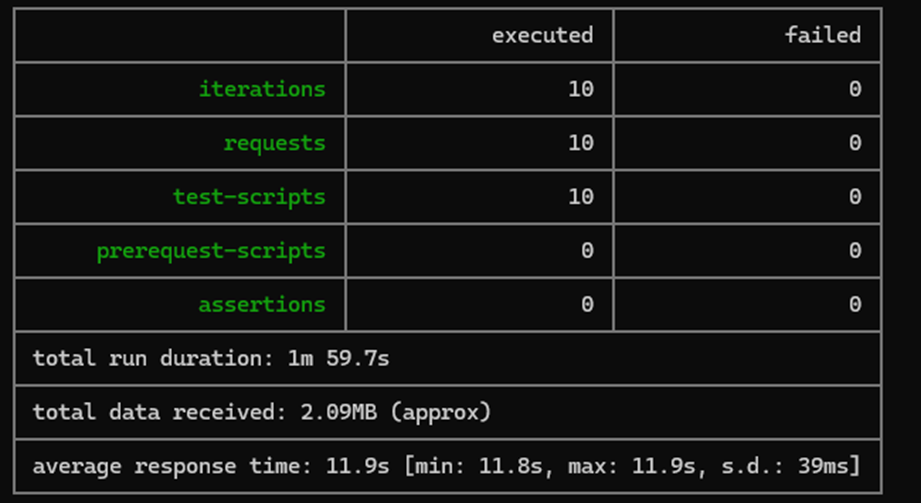
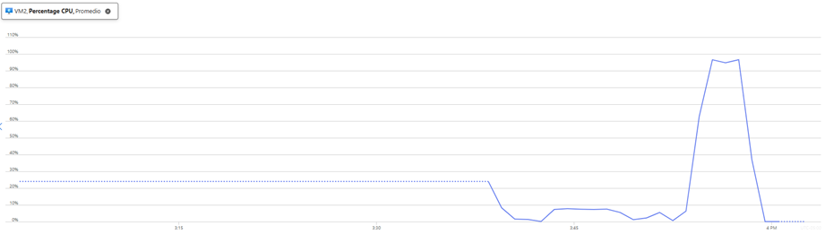

### Escuela Colombiana de Ingeniería
### Arquitecturas de Software - ARSW

## Escalamiento en Azure con Maquinas Virtuales, Sacale Sets y Service Plans

### Dependencias
* Cree una cuenta gratuita dentro de Azure. Para hacerlo puede guiarse de esta [documentación](https://azure.microsoft.com/es-es/free/students/). Al hacerlo usted contará con $100 USD para gastar durante 12 meses.

### Parte 0 - Entendiendo el escenario de calidad

Adjunto a este laboratorio usted podrá encontrar una aplicación totalmente desarrollada que tiene como objetivo calcular el enésimo valor de la secuencia de Fibonnaci.

**Escalabilidad**
Cuando un conjunto de usuarios consulta un enésimo número (superior a 1000000) de la secuencia de Fibonacci de forma concurrente y el sistema se encuentra bajo condiciones normales de operación, todas las peticiones deben ser respondidas y el consumo de CPU del sistema no puede superar el 70%.

### Parte 1 - Escalabilidad vertical

1. Diríjase a el [Portal de Azure](https://portal.azure.com/) y a continuación cree una maquina virtual con las características básicas descritas en la imágen 1 y que corresponden a las siguientes:
    * Resource Group = SCALABILITY_LAB
    * Virtual machine name = VERTICAL-SCALABILITY
    * Image = Ubuntu Server 
    * Size = Standard B1ls
    * Username = scalability_lab
    * SSH publi key = Su llave ssh publica


2. Para conectarse a la VM use el siguiente comando, donde las `x` las debe remplazar por la IP de su propia VM (Revise la sección "Connect" de la virtual machine creada para tener una guía más detallada).

    `ssh scalability_lab@xxx.xxx.xxx.xxx`


   Una vez ya creada la VM procedemos con la conexión.


3. Instale node, para ello siga la sección *Installing Node.js and npm using NVM* que encontrará en este [enlace](https://linuxize.com/post/how-to-install-node-js-on-ubuntu-18.04/).


   Instalación:


4. Para instalar la aplicación adjunta al Laboratorio, suba la carpeta `FibonacciApp` a un repositorio al cual tenga acceso y ejecute estos comandos dentro de la VM:

    `git clone <your_repo>`

    `cd <your_repo>/FibonacciApp`

    `npm install`

Clonar repositorio e instalación de NPM


5. Para ejecutar la aplicación puede usar el comando `npm FibinacciApp.js`, sin embargo una vez pierda la conexión ssh la aplicación dejará de funcionar. Para evitar ese compartamiento usaremos *forever*. Ejecute los siguientes comando dentro de la VM.

    ` node FibonacciApp.js`

Instalación de Forever


6. Antes de verificar si el endpoint funciona, en Azure vaya a la sección de *Networking* y cree una *Inbound port rule* tal como se muestra en la imágen. Para verificar que la aplicación funciona, use un browser y user el endpoint `http://xxx.xxx.xxx.xxx:3000/fibonacci/6`. La respuesta debe ser `The answer is 8`.


Regla de puerto de entrada




7. La función que calcula en enésimo número de la secuencia de Fibonacci está muy mal construido y consume bastante CPU para obtener la respuesta. Usando la consola del Browser documente los tiempos de respuesta para dicho endpoint usando los siguintes valores:
    * 1000000
    * 1010000
    * 1020000
    * 1030000
    * 1040000
    * 1050000
    * 1060000
    * 1070000
    * 1080000
    * 1090000    
   
Valores


8. Dírijase ahora a Azure y verifique el consumo de CPU para la VM. (Los resultados pueden tardar 5 minutos en aparecer).


Metricas


9. Ahora usaremos Postman para simular una carga concurrente a nuestro sistema. Siga estos pasos.
    * Instale newman con el comando `npm install newman -g`. Para conocer más de Newman consulte el siguiente [enlace](https://learning.getpostman.com/docs/postman/collection-runs/command-line-integration-with-newman/).
    * Diríjase hasta la ruta `FibonacciApp/postman` en una maquina diferente a la VM.
    * Para el archivo `[ARSW_LOAD-BALANCING_AZURE].postman_environment.json` cambie el valor del parámetro `VM1` para que coincida con la IP de su VM.
    * Ejecute el siguiente comando.

    ```
    newman run ARSW_LOAD-BALANCING_AZURE.postman_collection.json -e [ARSW_LOAD-BALANCING_AZURE].postman_environment.json -n 10 &
    newman run ARSW_LOAD-BALANCING_AZURE.postman_collection.json -e [ARSW_LOAD-BALANCING_AZURE].postman_environment.json -n 10
    ```
Instalación Postman


Resultado


10. La cantidad de CPU consumida es bastante grande y un conjunto considerable de peticiones concurrentes pueden hacer fallar nuestro servicio. Para solucionarlo usaremos una estrategia de Escalamiento Vertical. En Azure diríjase a la sección *size* y a continuación seleccione el tamaño `B2ms`.


Se realizan los cmabios debidos satisfactoriamente.

11. Una vez el cambio se vea reflejado, repita el paso 7, 8 y 9.

Metricas y resultados nuevamente.


12. Evalue el escenario de calidad asociado al requerimiento no funcional de escalabilidad y concluya si usando este modelo de escalabilidad logramos cumplirlo.

Respuesta: Si se logro reducir el consumo.

13. Vuelva a dejar la VM en el tamaño inicial para evitar cobros adicionales.


**Preguntas**

1. ¿Cuántos y cuáles recursos crea Azure junto con la VM?


2. ¿Brevemente describa para qué sirve cada recurso?

#### Maquina virtual: 
Proporciona capacidad de computación en la nube, permitiendo ejecutar sistemas operativos y aplicaciones como si fuera un servidor físico.

#### Dirección IP Publica:
Permite que tu máquina virtual sea accesible desde Internet.

#### Grupo de seguridad de red:
Define reglas de entrada/salida para permitir o denegar tráfico a tus recursos.

#### Red virtual:
Conecta tus recursos de Azure entre sí y con redes locales.

#### Interfaz de red:
Permite a la VM comunicarse con Internet, Azure y recursos locales.

#### Disco:
Almacena el sistema operativo, aplicaciones y datos.

3. ¿Al cerrar la conexión ssh con la VM, por qué se cae la aplicación que ejecutamos con el comando `npm FibonacciApp.js`? ¿Por qué debemos crear un *Inbound port rule* antes de acceder al servicio?
   La app se cierra al salir de SSH porque los procesos dependen de la sesión terminal. Usa nohup, tmux o PM2 para evitarlo.

El Inbound Port Rule es necesario porque Azure bloquea el tráfico entrante por defecto. Sin él, el firewall rechaza las conexiones a tu app.

4. Adjunte tabla de tiempos e interprete por qué la función tarda tando tiempo.


La función getNthNumberInSequence en FibonacciService tiene un problema de rendimiento debido a su implementación recursiva sin optimización. Al calcular números de Fibonacci de manera recursiva tradicional, cada llamada genera dos nuevas llamadas, creciendo exponencialmente (O(2^n)). Esto significa que, por ejemplo, calcular el Fibonacci de 30 no toma el doble que el de 29, sino que el tiempo se dispara de forma mucho más agresiva. En los resultados de la tabla, esto se traduce en que, a medida que el valor de *n* aumenta (como en los endpoints 1,000,000 a 1,090,000), el tiempo de respuesta no crece linealmente, sino que se multiplica rápidamente, superando fácilmente los 10 segundos. Esto evidencia que el algoritmo actual no es escalable para entradas grandes, requiriendo optimizaciones como memoización, programación dinámica o incluso soluciones iterativas para reducir la complejidad a O(n) u O(1).

5. Adjunte imágen del consumo de CPU de la VM e interprete por qué la función consume esa cantidad de CPU.


La función getNthNumberInSequence consume una cantidad excesiva de recursos de CPU porque realiza operaciones aritméticas con números extremadamente grandes. Cada cálculo no solo implica sumas básicas, sino también manejo de enteros de gran escala, donde cada dígito adicional incrementa la complejidad de las operaciones a nivel de bits. Esto fuerza a la CPU a ejecutar más ciclos de procesamiento por cada iteración, generando un cuello de botella en el rendimiento. A medida que el valor de entrada crece, el tiempo de procesamiento se dispara, ya que las operaciones requieren más pasos computacionales y mayor uso de registros, saturando la capacidad de cómputo disponible.

6. Adjunte la imagen del resumen de la ejecución de Postman. Interprete:
    * Tiempos de ejecución de cada petición.
    * Si hubo fallos documentelos y explique.

Se tuyvo un promedio de tiempo de ejecución de 10.9 segundos, sin ningun error. 


7. ¿Cuál es la diferencia entre los tamaños `B2ms` y `B1ls` (no solo busque especificaciones de infraestructura)?

B2ms:

Tiene 2 vCPUs y 8 GB de RAM. Es ideal para aplicaciones con picos ocasionales de demanda (ej.: servidores web con tráfico variable).

B1ls:

Es el tamaño más pequeño de la serie B (1 vCPU, 0.5 GB de RAM). Adecuado para tareas mínimas o de bajo consumo (ej.: procesos en segundo plano sin críticas de velocidad).

8. ¿Aumentar el tamaño de la VM es una buena solución en este escenario?, ¿Qué pasa con la FibonacciApp cuando cambiamos el tamaño de la VM?

La complejidad algorítmica exponencial (O(2^n)) persiste. Aunque la VM sea más potente, el tiempo de cálculo seguirá creciendo desproporcionadamente para valores altos de n.
Por lo que solo soluciona el problema de manera temporal

9. ¿Qué pasa con la infraestructura cuando cambia el tamaño de la VM? ¿Qué efectos negativos implica?

Tiempo de inactividad:

El cambio requiere un reinicio, lo que implica downtime.

Costos exponenciales:

Una VM con el doble de recursos puede costar 4 veces más, pero no entregará 4 veces mejor rendimiento en este caso.

Límites de suscripción/región:

Algunas regiones tienen cuotas de vCPUs. Cambiar a tamaños grandes puede requerir solicitar aumentos a Microsoft.

Ineficiencia energética:

Usar una VM sobredimensionada para un algoritmo ineficiente es como "usar un Ferrari para un embotellamiento".

10. ¿Hubo mejora en el consumo de CPU o en los tiempos de respuesta? Si/No ¿Por qué?

Los resultados reflejan una clara mejora en el rendimiento del sistema tras la migración de una instancia B1ls a una B2ms. Esta optimización se manifiesta en un procesamiento más eficiente y tiempos de respuesta más rápidos, logrados gracias a las ventajas clave de la instancia B2ms:

Mayor capacidad de cómputo debido a su configuración multicore

Ampliación considerable de los recursos de memoria

Mayor espacio de almacenamiento disponible

La comparación demuestra cómo el aumento de recursos hardware se traduce directamente en un mejor desempeño del sistema.

11. Aumente la cantidad de ejecuciones paralelas del comando de postman a `4`. ¿El comportamiento del sistema es porcentualmente mejor?

### Parte 2 - Escalabilidad horizontal

#### Crear el Balanceador de Carga

Antes de continuar puede eliminar el grupo de recursos anterior para evitar gastos adicionales y realizar la actividad en un grupo de recursos totalmente limpio.

1. El Balanceador de Carga es un recurso fundamental para habilitar la escalabilidad horizontal de nuestro sistema, por eso en este paso cree un balanceador de carga dentro de Azure tal cual como se muestra en la imágen adjunta.


2. A continuación cree un *Backend Pool*, guiese con la siguiente imágen.


3. A continuación cree un *Health Probe*, guiese con la siguiente imágen.


4. A continuación cree un *Load Balancing Rule*, guiese con la siguiente imágen.


5. Cree una *Virtual Network* dentro del grupo de recursos, guiese con la siguiente imágen.


Creación de la red virtual


#### Crear las maquinas virtuales (Nodos)

Ahora vamos a crear 3 VMs (VM1, VM2 y VM3) con direcciones IP públicas standar en 3 diferentes zonas de disponibilidad. Después las agregaremos al balanceador de carga.

1. En la configuración básica de la VM guíese por la siguiente imágen. Es importante que se fije en la "Avaiability Zone", donde la VM1 será 1, la VM2 será 2 y la VM3 será 3.


2. En la configuración de networking, verifique que se ha seleccionado la *Virtual Network*  y la *Subnet* creadas anteriormente. Adicionalmente asigne una IP pública y no olvide habilitar la redundancia de zona.


3. Para el Network Security Group seleccione "avanzado" y realice la siguiente configuración. No olvide crear un *Inbound Rule*, en el cual habilite el tráfico por el puerto 3000. Cuando cree la VM2 y la VM3, no necesita volver a crear el *Network Security Group*, sino que puede seleccionar el anteriormente creado.


4. Ahora asignaremos esta VM a nuestro balanceador de carga, para ello siga la configuración de la siguiente imágen.


5. Finalmente debemos instalar la aplicación de Fibonacci en la VM. para ello puede ejecutar el conjunto de los siguientes comandos, cambiando el nombre de la VM por el correcto

```
git clone https://github.com/daprieto1/ARSW_LOAD-BALANCING_AZURE.git

curl -o- https://raw.githubusercontent.com/creationix/nvm/v0.34.0/install.sh | bash
source /home/vm1/.bashrc
nvm install node

cd ARSW_LOAD-BALANCING_AZURE/FibonacciApp
npm install

npm install forever -g
forever start FibonacciApp.js
```

Creación de VM's 

#### NOTA : solo se pudieron crear 2 por que azure para estudiantes solo permite 3 IPS (dos pa las nuevas VM y la otra es para el balanceador.

VM1 CON ZONA 1


NETWORK


VM2




Realice este proceso para las 3 VMs, por ahora lo haremos a mano una por una, sin embargo es importante que usted sepa que existen herramientas para aumatizar este proceso, entre ellas encontramos Azure Resource Manager, OsDisk Images, Terraform con Vagrant y Paker, Puppet, Ansible entre otras.

#### Probar el resultado final de nuestra infraestructura

1. Porsupuesto el endpoint de acceso a nuestro sistema será la IP pública del balanceador de carga, primero verifiquemos que los servicios básicos están funcionando, consuma los siguientes recursos:

```
http://52.155.223.248/
http://52.155.223.248/fibonacci/1
```


2. Realice las pruebas de carga con `newman` que se realizaron en la parte 1 y haga un informe comparativo donde contraste: tiempos de respuesta, cantidad de peticiones respondidas con éxito, costos de las 2 infraestrucruras, es decir, la que desarrollamos con balanceo de carga horizontal y la que se hizo con una maquina virtual escalada.







3. Agregue una 4 maquina virtual y realice las pruebas de newman, pero esta vez no lance 2 peticiones en paralelo, sino que incrementelo a 4. Haga un informe donde presente el comportamiento de la CPU de las 4 VM y explique porque la tasa de éxito de las peticiones aumento con este estilo de escalabilidad.

```
newman run ARSW_LOAD-BALANCING_AZURE.postman_collection.json -e [ARSW_LOAD-BALANCING_AZURE].postman_environment.json -n 10 &
newman run ARSW_LOAD-BALANCING_AZURE.postman_collection.json -e [ARSW_LOAD-BALANCING_AZURE].postman_environment.json -n 10 &
newman run ARSW_LOAD-BALANCING_AZURE.postman_collection.json -e [ARSW_LOAD-BALANCING_AZURE].postman_environment.json -n 10 &
newman run ARSW_LOAD-BALANCING_AZURE.postman_collection.json -e [ARSW_LOAD-BALANCING_AZURE].postman_environment.json -n 10
```

**Preguntas**

* ¿Cuáles son los tipos de balanceadores de carga en Azure y en qué se diferencian?, ¿Qué es SKU, qué tipos hay y en qué se diferencian?, ¿Por qué el balanceador de carga necesita una IP pública?

SKU significa "Stock Keeping Unit", y en Azure se usa para definir la versión o tipo de un servicio (como un "modelo" o "categoría").

El Basic Load Balancer es más limitado. Es ideal para pruebas, entornos pequeños o no críticos. Tiene menos configuraciones de seguridad y no está pensado para escalabilidad grande ni para usarse con zonas de disponibilidad (Availability Zones).

El Standard Load Balancer, en cambio, es el recomendado para producción. Permite más control sobre el tráfico, se integra con zonas de disponibilidad (lo que mejora la tolerancia a fallos), maneja tráfico de más instancias, y requiere configuraciones más específicas como reglas de seguridad más detalladas.

El balanceador necesita una IP pública para que el tráfico desde internet pueda llegar a él.

* ¿Cuál es el propósito del *Backend Pool*?

El Backend Pool es el grupo de máquinas o servicios donde realmente se ejecutan tus aplicaciones. El balanceador envía tráfico a estas máquinas. Es decir, el tráfico entra por la IP pública del balanceador y se distribuye entre los miembros del backend pool.

* ¿Cuál es el propósito del *Health Probe*?

El Health Probe es una herramienta que verifica si las máquinas del backend pool están funcionando correctamente.

* ¿Cuál es el propósito de la *Load Balancing Rule*? ¿Qué tipos de sesión persistente existen, por qué esto es importante y cómo puede afectar la escalabilidad del sistema?.

Una Load Balancing Rule define cómo se debe distribuir el tráfico entrante.

Existen 2 tipos:

None: no hay persistencia. Cada petición puede ir a una máquina diferente. Esto es lo mejor para escalar porque balancea más parejo.

Client IP: todas las peticiones de una misma IP van siempre a la misma máquina. Es útil si la app necesita mantener estado (como sesiones de usuario), pero puede hacer que una máquina se sobrecargue mientras otras están libres.

* ¿Qué es una *Virtual Network*? ¿Qué es una *Subnet*? ¿Para qué sirven los *address space* y *address range*?

Una Virtual Network (VNet) es como una red local privada dentro de Azure. Ahí conectás tus máquinas virtuales, servicios y balanceadores.

Una Subnet es una división dentro de esa VNet. Sirve para segmentar y organizar tu red. Por ejemplo, podés tener una subnet para frontend y otra para backend, cada una con sus reglas y recursos.

El address space es el rango completo de direcciones IP que puede usar una VNet.

El address range define el subconjunto de IPs para cada subnet.

* ¿Qué son las *Availability Zone* y por qué seleccionamos 3 diferentes zonas?. ¿Qué significa que una IP sea *zone-redundant*?

Las Availability Zones son ubicaciones físicas separadas dentro de una región.

Una IP zone-redundant es una dirección IP pública que puede usarse desde cualquiera de las zonas sin estar atada a una sola.

* ¿Cuál es el propósito del *Network Security Group*?

Un Network Security Group es como un firewall: controla qué tráfico entra o sale de tus recursos.

* Informe de newman 1 (Punto 2)

Escalado Vertical:


Escalado Horizontal:


Como se puede ver el tiempo promedio del escalado horizontal es menor que el del vertical, siendo asi que se evidencia la mayor eficiencia del escalado horizontal.

* Presente el Diagrama de Despliegue de la solución.


